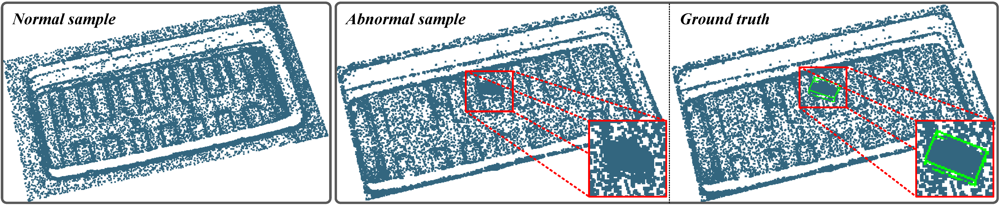

# Auxiliary Information Flow for 3D Anomaly Detection on IC Ceramic Package Substrate Surfaces: Dataset and Benchmark

Abstract: The ceramic package substrate plays a crucial role in the field of integrated circuit manufacturing.
Nevertheless, the lack of a well-defined dataset and benchmark, as well as the scarcity of abnormal ceramic package substrate samples, hinder further research and optimization of the project.
To address these issues, we introduce CPSDET-3D, a high-precision 3D industrial anomaly detection dataset based on IC ceramic packaging substrates.
All of the samples are collected from the multi-batch production stages in actual industrial production scenarios.
With 1640 high spatial resolution point cloud samples (0.0025 mm) and hundreds of millions of total points, CPSDET-3D is the largest 3D anomaly detection dataset to date.
In addition, we propose a benchmark AIFAD, an end-to-end point cloud anomaly detection method based on auxiliary information flows.
AIFAD transforms sparse convolutions into dense features to enhance the sparse backbone and does not rely on handcrafted proxies.
Through comprehensive evaluations, we demonstrate the relevance and effectiveness of our dataset and benchmark.

### Experimental results

  

