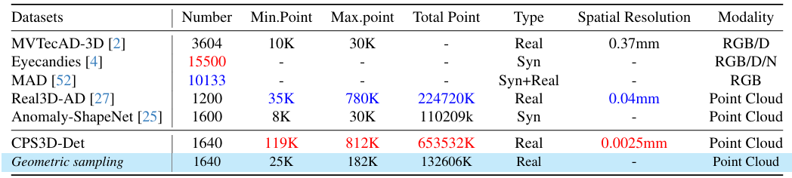
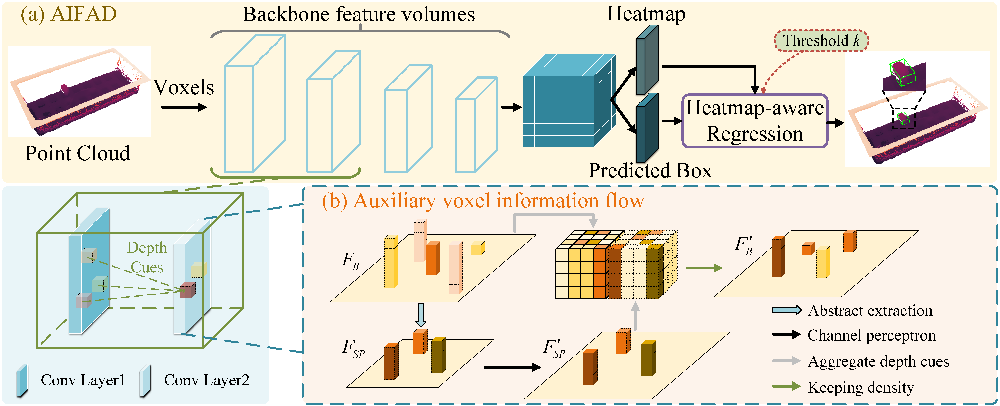
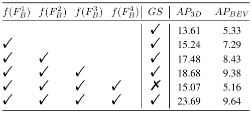

# Auxiliary Information Flow for 3D Anomaly Detection on IC Ceramic Package Substrate Surfaces: Dataset and Benchmark

Abstract: The ceramic package substrate plays a crucial role in the field of integrated circuit manufacturing.
Nevertheless, the lack of a well-defined dataset and benchmark, as well as the scarcity of abnormal ceramic package substrate samples, hinder further research and optimization of the project.
To address these issues, we introduce CPSDET-3D, a high-precision 3D industrial anomaly detection dataset based on IC ceramic packaging substrates.
All of the samples are collected from the multi-batch production stages in actual industrial production scenarios.
With 1640 high spatial resolution point cloud samples (0.0025 mm) and hundreds of millions of total points, CPSDET-3D is the largest 3D anomaly detection dataset to date.
In addition, we propose a benchmark AIFAD, an end-to-end point cloud anomaly detection method based on auxiliary information flows.
AIFAD transforms sparse convolutions into dense features to enhance the sparse backbone and does not rely on handcrafted proxies.
Through comprehensive evaluations, we demonstrate the relevance and effectiveness of our dataset and benchmark.


### Evaluation
We provide the trained weight file so you can just run with that. You can also use the model you trained.

```shell
cd tools 
bash scripts/dist_test.sh NUM_GPUS --cfg_file PATH_TO_CONFIG_FILE --ckpt PATH_TO_MODEL
#For example,
bash scripts/dist_test.sh 8 --cfg_file PATH_TO_CONFIG_FILE --ckpt PATH_TO_MODEL
```


### Training

```shell
bash scripts/dist_train.sh NUM_GPUS --cfg_file PATH_TO_CONFIG_FILE
#For example,
bash scripts/dist_train.sh 8 --cfg_file PATH_TO_CONFIG_FILE
```

### Comparison between the proposed CPSDET-3D and existing mainstream 3D anomaly detection datasets.
<p align="center">  </p>


### Illustration of the acquisition process of CPSDET-3D.
<p align="center">  </p>


### Examples of the proposed CPSDET-3D.
<p align="center">  </p>


### Illustration of mainstream methods in the field of 3D anomaly detection.
<p align="center">  </p>


### Illustration of the proposed AIFAD.
<p align="center">  </p>


### Illustration of the heatmap-aware regression.
<p align="center">  </p>


### Performance of AIFAD and the state-of-the-art methods on CPSDET-3D validation set.
<p align="center">  </p>


### Effects of auxiliary voxel information flows.
<p align="center">  </p>


### Effects of heatmap-aware regression and anchor-based strategy.
<p align="center">  </p>


### Qualitative illustration of the predicted boxes of AIFAD on the CPSDET-3D validation set.
<p align="center">  </p>


### Qualitative illustration of the predicted boxes of AIFAD and the state-of-the-art methods on the CPSDET-3D validation set.
<p align="center">  </p>
